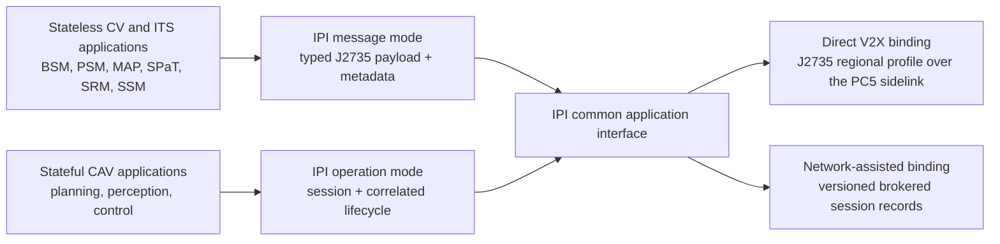

# Intersection Programming Interface (IPI)

The Intersection Programming Interface (IPI) is an application protocol and
C++17 reference implementation for connected vehicles (CVs), connected and
automated vehicles (CAVs), and intelligent transportation systems (ITS). It
provides one typed interface for two application classes:

1. Stateless CV and ITS applications exchange compact, independently useful
   messages such as Basic Safety Message (BSM), Personal Safety Message (PSM),
   Map Data (MAP), Signal Phase and Timing (SPaT), Signal Request Message (SRM),
   and Signal Status Message (SSM).
2. Stateful CAV applications exchange correlated requests, updates, results,
   telemetry, and termination records for cooperative planning, perception,
   and control.

IPI preserves the application identity, timing, payload, correlation, and
outcome information needed by both classes. Transport adapters can then carry
the same application contract over direct vehicle-to-everything (V2X) links or
network-assisted Internet Protocol (IP) paths. IPI is not a radio bearer, a
fifth-generation (5G) scheduler, or a vehicle-motion controller.

## Why a unified protocol is needed

Existing CV and ITS applications commonly publish compact state updates. A
receiver can often use the newest message without retaining a long interaction
history. Complex CAV applications behave differently. A vehicle may request
cooperative perception, submit additional state, receive one or more progress
updates, and then receive a completed or rejected result. Every record must
remain associated with the correct vehicle, session, request, deadline, and
application operation.

Without a common interface, each CAV application must define its own messages,
correlation rules, expiration behavior, and failure states. IPI combines the
two application classes without forcing them into one interaction pattern.
Stateless messages remain simple. Stateful operations receive the lifecycle
and correlation fields they require.

## Protocol model



The unification occurs at the application contract. Each transport binding may
use the framing appropriate to its path while preserving the same identities,
timestamps, correlations, deadlines, payload types, and outcomes.

### Stateless message mode

The message mode carries individual SAE International J2735 payloads through a
common envelope. The envelope records:

- a message identifier and send time;
- the intersection and source identity;
- the selected transport;
- optional session, correlation, sequence, priority, and expiration fields;
- the J2735 message type, encoding, bytes, and optional frame counter.

The reference API provides typed helpers for BSM, PSM, MAP, SPaT, SRM, and SSM.
It also accepts pre-encoded J2735 `MessageFrame` bytes for message types that do
not yet have a lightweight C++ model.

### Stateful operation mode

The operation mode associates multiple records with one CAV service operation.
Its lifecycle is:

1. The vehicle registers and receives a session identifier.
2. The first valid heartbeat activates the session and starts a renewable
   monotonic lease.
3. The vehicle submits a service request with a unique message identifier,
   correlation identifier, sequence number, and optional expiration time.
4. The service returns progress or terminal results. Terminal states include
   completion, rejection, timeout, missing response, interruption, expiration,
   and fallback completion.
5. Either endpoint terminates the session, or the lease expires.

The lifecycle rejects inactive or expired sessions, duplicate identities,
stale sequences, mismatched vehicles or intersections, unmatched responses,
duplicate results, and additional terminal results after an operation has
finished. Failures use machine-readable codes such as `STALE_REQUEST`,
`CORRELATION_MISMATCH`, `TRANSPORT_INTERRUPTION`, and `SERVICE_UNAVAILABLE`.

### Cooperative CAV content

The current cooperative-service model supports three service classes:

- guided planning, including bounded waypoint sequences and fallback routes;
- guided perception, including typed detected objects, position, velocity, and
  covariance content;
- guided control, including bounded steering, throttle, and brake commands.

Each cooperative-service record carries a 16-byte session identifier, vehicle
identifier, service class, and one of four lifecycle states: `request`,
`update`, `complete`, or `reject`. Optional fields describe the requested
horizon, confidence, expiration time, service payload, and offload content.

## J2735 regional profile

[`cpp/asn1/IPI.asn`](cpp/asn1/IPI.asn) defines
`IpiCooperativeService` as a typed J2735 regional value. The current profile is
carried inside the reserved `TestMessage00` frame with `DSRCmsgID` 240 and local
`RegionId` 200. The region identifier belongs to J2735's uncoordinated range;
deployments that share a radio domain must prevent identifier collisions.

`ipi::v2x::J2735IpiRegionalCodec` encodes and decodes the complete unaligned
Packed Encoding Rules (UPER) `MessageFrame`. The checked-in tests cover field
bounds, optional content, malformed frames, unexpected identifiers, padding,
extensions, and size limits. Deterministic vectors were generated with two
independent Abstract Syntax Notation One (ASN.1) implementations, and the outer
frame was checked with the United States Department of Transportation J2735
reference package.

SAE distributes its normative ASN.1 modules separately. Production compilation
therefore requires a licensed J2735 module set and a compatible ASN.1 compiler.
The preparation and verification procedures are documented in
[`cpp/asn1/README.md`](cpp/asn1/README.md).

## Current transport bindings

The current IP binding uses Message Queuing Telemetry Transport (MQTT) over
Transmission Control Protocol (TCP). The direct V2X binding uses the PC5
sidelink interface.

| Binding | Purpose | Current implementation |
| --- | --- | --- |
| In-memory | Protocol development and deterministic tests | Uses the complete session lifecycle without an external broker. |
| MQTT session | Stateful CV and CAV operations over an IP path | Uses strict, versioned `IPIS` records and hierarchical IPI topics over MQTT 3.1.1. The bundled client currently uses Quality of Service (QoS) level 0 and plain TCP. |
| PC5 | Direct V2X request and response exchange | Uses a size-bounded `IP5X` envelope, protected by a cyclic redundancy check (CRC), that contains a complete J2735 IPI `MessageFrame`. |
| Pre-encoded J2735 pass-through | Integration with generated or vendor J2735 stacks | Preserves complete externally encoded `MessageFrame` payloads through the IPI envelope. |

The `IPIS` session-record marker and `IP5X` PC5-envelope marker identify
versioned implementation bindings for the IPI contract. They are not new
standardized J2735 bearers. The Mocar PC5 sample uses the vendor custom-message
channel and validates the IPI frame at both endpoints.

The repository also contains TCP, MQTT, and User Datagram Protocol (UDP)
latency probes. Those programs are measurement tools rather than additional
IPI lifecycle transports. In the private-5G workload experiments, the vehicle
sends an N-byte IPI request to the infrastructure endpoint and receives a
compact correlated acknowledgement. That exchange does not represent a
download-heavy response workload.

## Edge-to-device SPaT over TCP

The repository includes a bridge that forwards a typed SPaT message from an
edge host to a Mocar device over an Ethernet TCP connection. The device bridge
validates the frame and passes it to the vendor J2735 stack for radio
broadcast. This bridge is an integration adapter; the Ethernet hop is not a
second wireless path.

Build the host sender and device bridge from the repository root:

```bash
cmake -S cpp -B cpp/build
cmake --build cpp/build --target example_spat_tcp_sender
make -C third_party/mocar/J2735-2020/samples/ipi_spat_bridge
```

Run the bridge on the Mocar device, then point the host sender at the device:

```bash
./ipi_spat_bridge
./cpp/build/example_spat_tcp_sender <device-ip> 35555
```

See [`setup.md`](setup.md) for device libraries, cross-compilation, deployment,
and runtime configuration.

## C++ reference implementation

The public library is organized by responsibility:

| Module | Responsibility |
| --- | --- |
| `ipi::core` | Service requests, cooperative-service content, common frames, and validation. |
| `ipi::api` | Common envelopes, sender and receiver interfaces, session lifecycle, MQTT transport, PC5 adapter, and measurement helpers. |
| `ipi::v2x` | J2735 message helpers, the formal IPI regional UPER codec, and optional Robot Operating System 2 (ROS 2) conversions. |
| `ipi::activation` | Infrastructure activation zones and transition state. |
| `ipi::policy` | Tier-aware service decisions and explicit fallback outcomes. |
| `ipi::offload` | Deadline- and confidence-aware local or network execution decisions. |
| `ipi::mesh` | Neighbor state and cooperative task lifecycle helpers. |

The high-level `ipi::api::Edge4AvInterface` class exposes both typed V2X
message operations and private-session operations. Applications can replace
the in-memory sender, receiver, and session transport with deployment-specific
adapters without changing the application data model.

## Build and test

Requirements:

- Linux;
- CMake 3.16 or later;
- a C++17 compiler;
- POSIX threads;
- Python 3 when schema-preparation tests are enabled.

From the repository root:

```bash
cmake -S cpp -B cpp/build \
  -DIPI_ENABLE_TESTS=ON \
  -DIPI_BUILD_EXAMPLES=ON
cmake --build cpp/build --parallel
ctest --test-dir cpp/build --output-on-failure
```

Useful examples:

```bash
./cpp/build/example_build_service_request
./cpp/build/example_v2x_roundtrip
./cpp/build/example_edge4av_dual_plane
```

- [`build_service_request.cpp`](cpp/examples/library/build_service_request.cpp)
  constructs an IPI service request and a stateful cooperative CAV message.
- [`v2x_roundtrip.cpp`](cpp/examples/library/v2x_roundtrip.cpp) exercises the
  supported J2735 helper models.
- [`edge4av_dual_plane.cpp`](cpp/examples/library/edge4av_dual_plane.cpp)
  demonstrates typed V2X ingestion, session registration, heartbeat
  activation, a correlated service request, and telemetry submission through
  one API.

To install the CMake package:

```bash
cmake -S cpp -B cpp/build \
  -DCMAKE_INSTALL_PREFIX="$PWD/cpp/install"
cmake --build cpp/build --parallel
cmake --install cpp/build
```

Downstream projects can then use:

```cmake
find_package(IPI CONFIG REQUIRED)
target_link_libraries(my_target PRIVATE IPI::ipi)
```

See [`setup.md`](setup.md) for Mocar device builds, PC5 exchange commands,
private-5G measurement tools, MQTT setup, and the complete deployment sequence.

## Repository map

| Path | Contents |
| --- | --- |
| [`cpp/`](cpp/) | C++17 library, ASN.1 profile, examples, and tests. |
| [`ros2_ws/src/ipi_msgs/`](ros2_ws/src/ipi_msgs/) | ROS 2 messages for activation, policy, and offload decisions. |
| [`ros2_ws/src/ipi_runtime/`](ros2_ws/src/ipi_runtime/) | ROS 2 reference nodes that publish decisions while leaving vehicle control to an approved local adapter. |
| [`ros2_ws/src/v2x_msg/`](ros2_ws/src/v2x_msg/) | ROS 2 J2735-style message assets. |
| [`third_party/mocar/`](third_party/mocar/) | Vendor SDK material and optional RSU/OBU samples. |
| [`scripts/`](scripts/) | Schema tools, experiment runners, analysis, and plotting utilities. |
| [`benchmarks/v2x/`](benchmarks/v2x/) | V2X workload and dataset staging. |
| [`results/`](results/) | Recorded direct-V2X, private-5G, and benchmark evidence. |
| [`web/experiment-tracker/`](web/experiment-tracker/) | Static experiment-tracking interface. |

Additional documentation:

- [`cpp/README.md`](cpp/README.md) describes the C++ modules and optional build
  flags.
- [`cpp/examples/README.md`](cpp/examples/README.md) lists the host and device
  examples.
- [`experiment_summary.md`](experiment_summary.md) summarizes the collected
  evidence.
- [`remaining_exp.md`](remaining_exp.md) records pending experiment procedures
  and evidence boundaries.
- [`results/README.md`](results/README.md) describes the result archive.

## Scope and release status

IPI is a research reference implementation. It is not an SAE or Third
Generation Partnership Project (3GPP) standard, and the repository does not
claim production certification or cross-vendor interoperability. A production
deployment must provide its own security policy, credential management,
standard-conformant J2735 toolchain, radio configuration, broker access control,
transport encryption, and safety validation.

The ROS 2 runtime publishes activation, policy, and offload decisions. It does
not command vehicle motion or change an automated-driving mode. Local vehicle
software retains safety authority and must reject stale or unsafe requests.

The Edge4AV material in this repository is the associated research paper and
experiment campaign. `Edge4AV` is not the protocol name; the protocol and
reference implementation are IPI.

## License

This repository does not currently contain an approved top-level software
license. Do not assume redistribution or production-use rights. An approved
license must be added before an external software release.
