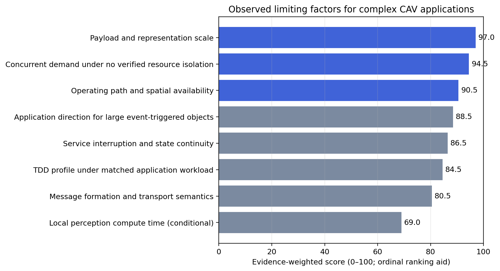
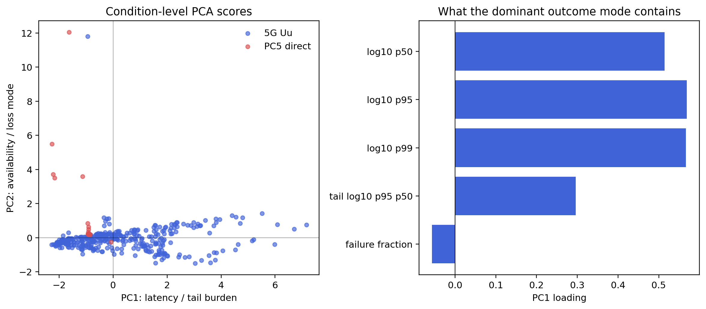
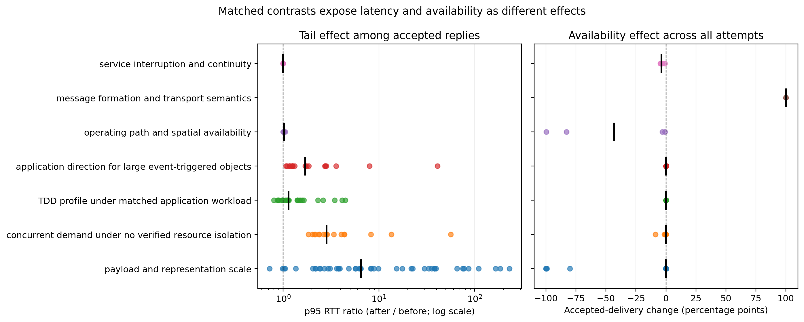
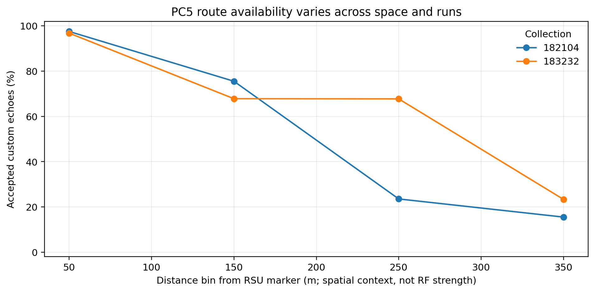

# Limiting Factors for Complex CAV Applications

## Answer

The collected evidence does not support a single explanation such as “insufficient bandwidth” or “weak signal.” It supports a broader diagnosis: the tested communication paths carry application data, but they do not expose a verified mechanism that jointly binds an application object’s size, direction, deadline, concurrency, and service state to admission, resource isolation, delivery, and recovery. Consequently, complex connected and automated vehicle (CAV) applications fail in several distinct ways. Large objects accumulate seconds of delay, concurrent flows enlarge tails, a spatially adverse direct-radio path stops returning replies, oversized datagrams cross formation limits, and process restarts create multi-second service gaps.

The evidence-based ordinal ranking is:

1. **Payload and representation scale.** The communication paths do not absorb large CAV data objects within short application deadlines.
2. **Concurrent demand under no verified resource isolation.** Simultaneous application traffic and background uplink traffic enlarge latency tails, especially under adverse path conditions.
3. **Operating path and spatial availability.** Direct-radio availability and 5G performance vary across field contexts, but the stored evidence cannot identify a physical radio cause.
4. **Application direction for large event-triggered objects.** A matched weak-signal pair shows that a 500-KiB vehicle-to-edge object can occupy a very different latency regime from the same object returned by the edge.
5. **Service interruption and state continuity.** Transport reconnection does not provide application-level continuity for a stateful collaborative operation.
6. **Message formation and transport semantics.** Datagram formation, fragmentation, reliability, and request/response semantics determine whether an object can be exchanged at all.
7. **TDD profile under a matched downlink workload.** The same-cell comparison is valid, but the effect changes with payload, transport, and percentile and does not provide a universal uplink/downlink ranking.
8. **Local perception compute time, conditionally.** One complete detector workload takes seconds before communication is considered; this is important for that pipeline but is not a general communication-path result.

This is a ranking of observed application-path constraints in this repository. It is not a causal ranking of radio-layer mechanisms. Physical-layer telemetry needed for such a ranking was not collected.



## Data and analysis unit

The analysis script reads the current stored artifacts and produces one row per experimental condition or valid Airspan follow-up sample. It covers 429 condition-level observations and 1,769,863 application attempts. The attempt total is a coverage count, not a statistical weight. Each condition receives equal weight, so a 50,000-attempt multiclient sample cannot erase a 1,000-attempt payload condition.

The condition-level data include:

- private-5G payload sweeps, uplink-load runs, detector-output replays, logical-client scaling, injected restarts, the valid Airspan follow-up matrix, and 65 completed August 15--18 uplink-heavy or downlink-heavy RTT conditions;
- PC5 stationary payload sweeps and four mobility runs, including the two runs that retain per-attempt Global Navigation Satellite System (GNSS) joins; and
- public V2X workload sizes and the completed V2X-Radar detector benchmark as supporting pipeline evidence.

The analysis excludes aborted runs from the main comparison. It also avoids double-counting the July 3 PC5 source runs and their derived consolidated summary. For operator-stopped PC5 sweeps, the condition table uses the raw observed denominator rather than filling skipped attempts with synthetic timeouts. In addition, all-attempt 5G deadline availability requires both an accepted response and an RTT within the deadline. RTT percentiles describe accepted responses only.

The following artifacts are intentionally not pooled into the ranking:

- same-host loopback runs, because they do not measure a wireless path and include nested or repeated collections;
- the dataset/GPU file-processing benchmark, because it is neither detector inference nor a network transfer;
- setup and smoke-test logs, because they establish function rather than performance; and
- the iPhone and G-NetTrack radio surveys, because they are separate user equipment devices and are not synchronized with the vehicle gateway's requests.

## Why PCA is informative but cannot rank causes

Principal component analysis (PCA) uses five standardized outcome variables available across both communication paths: the logarithms of p50, p95, and p99 accepted-response RTT; p95-to-p50 tail inflation; and the all-attempt failure fraction. Conditions with fewer than 20 accepted replies are excluded from PCA because their successful-response percentiles are unstable or undefined. Those complete and near-complete outages remain in the matched availability analysis.

Among the 420 PCA-eligible conditions, the first component explains 60.99% of the variance. Its loadings are 0.515 for p50 RTT, 0.569 for p95 RTT, 0.567 for p99 RTT, and 0.291 for tail inflation. Thus, this component is a general latency and tail burden. The second component explains 20.48% and has a 0.859 loading on the failure fraction. Thus, availability is a distinct outcome rather than merely the far end of the latency distribution. The first three components explain 99.49% in total.

This separation matters. At PC5 point P4, the 1 KiB condition returns only 171 of 1,000 echoes, yet its p95 among those 171 replies is 111.7 ms. A successful-reply plot would show a modest RTT change and hide an 82.9% failure rate. Similarly, restart conditions retain ordinary RTTs outside the outage but contain 11.7–15.1 s gaps with no successful exchange. PCA identifies these two outcome modes; matched contrasts identify which controlled or partially controlled factors move them.



## Variance when an IPI attempt succeeds

A separate successful-attempt analysis returns to the individual sender records rather than estimating dispersion from condition summaries. It retains 1,749,930 finite positive RTT records from 420 conditions with at least 20 accepted responses. Each condition receives equal weight, matching the PCA analysis unit.

Because RTT spans multiple orders of magnitude, the primary decomposition uses log10 RTT. Differences between condition means explain 91.1% of successful-attempt variance, while attempt-to-attempt variation within a fixed condition explains 8.9%. Thus, the successful-response latency regime is determined mainly by the operating condition--payload, demand, path context, direction, formation, and interruption state--rather than by ordinary jitter around one stable mean.

Across conditions, the median coefficient of variation is 0.285 and the median p95/p50 ratio is 1.428. The 95th-percentile condition has a p95/p50 ratio of 5.599, and the maximum is 12.029. The median p95/p50 ratio is 1.456 across 395 private-5G conditions and 1.089 across 25 direct-PC5 conditions. The PC5 value is survivor-conditioned: conditions with fewer than 20 replies, including complete and near-complete outages, are excluded and must remain in the delivery analysis.

This result answers how predictable RTT is after an IPI attempt succeeds. It does not replace accepted delivery, deadline availability, or outage duration. Raw millisecond-squared variance, sample standard deviation, coefficient of variation, tail ratio, and the log-scale decomposition are retained in `successful_attempt_variance.csv` and `successful_attempt_variance_summary.json` and are regenerated by `scripts/analyze_successful_ipi_variance.py`.

## Ranking method

The rank combines matched experimental contrasts with five explicit 1–5 ratings: observed severity, repeatability, evidence breadth, identification strength, and relevance to complex CAV applications. The weights are 30%, 20%, 20%, 15%, and 15%, respectively. Because these weights express research judgment, the script also performs 20,000 sensitivity trials in which every weight varies independently from 0.5 to 1.5 times its stated value before renormalization.

Payload/representation scale remains first in 99.4% of sensitivity trials and never falls below second. Concurrent demand remains in the top three in every trial. The operating path/spatial factor is in the top three in 74.0% of trials, application direction in 15.3%, and service interruption in 10.7%. Therefore, the top two are robust, while the order of spatial availability, application direction, and interruption depends on whether breadth or identification strength receives more weight.

The numeric scores are ordinal aids rather than effect sizes. They should not appear in the paper as physical measurements.

| Rank | Limiting factor | Score | Evidence | Principal observed effect |
|---:|---|---:|:---:|---|
| 1 | Payload and representation scale | 97.0 | A− | Repeated seconds-scale tails and payload-dependent delivery collapse |
| 2 | Concurrent demand under no verified resource isolation | 94.5 | A− | 1.84–55.96× p95 increases; up to 8.689 percentage-point delivery loss |
| 3 | Operating path and spatial availability | 90.5 | B | Up to 99.8 percentage-point PC5 delivery loss with little change in survivor RTT |
| 4 | Application direction for large event-triggered objects | 88.5 | B+ | Matched 500-KiB MQTT uplink-heavy p95 is 40.95x the downlink-heavy p95 |
| 5 | Service interruption and state continuity | 86.5 | B+ | 11.7–15.1 s gaps after receiver or broker restart |
| 6 | Message formation and transport semantics | 80.5 | B | Raw large datagrams fail; fragmentation restores smaller exchanges but not 60 KiB reliability |
| 7 | TDD profile under matched downlink workload | 76.5 | B+ | Eight matched cells show a 1.14x median absolute p95 fold change and mixed direction |
| 8 | Local perception compute time, conditionally | 69.0 | B− | 3.570 s median per sample for one full detector configuration |



## 1. Payload and representation scale

This is the strongest and broadest factor because it recurs in private-5G sweeps, detector-output replay, PC5 sweeps, the August directional runs, and the public-workload inventory. Across 37 finite matched payload contrasts, the median absolute p95 fold change is 8.29 and the maximum is 230.92. Compact payload behavior is not strictly monotonic--the smallest favorable TCP contrast decreases from 138.0 to 99.8 ms--so the evidence does not support a claim that every additional byte raises latency. Instead, the path changes regime when the object becomes large relative to the available service envelope.

The repeated large-payload results make the regime change concrete:

- On May 13, MQTT p95 grows from 36.6 ms at 0 B to 2,536.4 ms at 2 MiB, a 69.3× increase. TCP grows from 138.0 to 3,632.8 ms, a 26.3× increase.
- On May 14, TCP p95 grows from 139.8 ms at 0 B to 10,767.2 ms at 2 MiB, a 77.0× increase.
- In detector replay, increasing the requested object from 4 KiB to 60 KiB raises MQTT p95 from 63.3 to 403.8 ms and TCP p95 from 105.7 to 381.4 ms at the favorable location. At the adverse location, the corresponding 60 KiB p95 values are 770.1 and 661.8 ms.
- Fragmented UDP accepts 20/100 60 KiB attempts at the favorable location and 0/100 at the adverse location, although smaller fragmented objects remain much more reliable.
- On PC5, 2 KiB succeeds 998/1,000 times at P2 but only 8/1,000 at P3. At P4, 1 KiB succeeds 171/1,000 times and the observed 2 KiB attempts receive no reply.

The workload inventory explains why this is not an artificial corner case. Among 22,431 raw files from the staged public V2X datasets, the median size is 134,797 B, p95 is 4,032,174 B, and 11,805 files (52.628%) exceed 60,000 B. If each raw file were carried without semantic reduction, the estimated number of 60,000 B application chunks has a median of 3, p95 of 68, and maximum of 786. These values describe raw files and a representation-pressure estimate. They are not transmitted messages and do not prove that an application must send entire sensor files.

The cause is therefore not the application deadline itself. The observed paths do not provide a verified application-aware mechanism that selects a representation, admits an object, reserves the required resources, or progressively delivers the most useful content according to object size and deadline. The effect is that complex objects enter the same path as compact requests and encounter seconds-scale delay or a formation/reliability boundary.

## 2. Concurrent demand under no verified resource isolation

Concurrent demand is second because it repeatedly changes tail latency while payload size and transport remain fixed. Across 16 matched client/load contrasts, the median p95 multiplier is 2.84 and the maximum is 55.96.

The logical-client experiments show a strong interaction with operating context:

- At the favorable location, increasing from 1 to 100 logical clients raises p95 by 1.84× for TCP, 2.02× for MQTT, and 2.80× for UDP.
- At the adverse location, the same change raises TCP p95 by 13.49× and MQTT p95 by 55.96×. UDP p95 rises by 2.10×, while accepted delivery falls from 99.5% to 90.811%.

These are logical clients on one vehicle gateway, not 100 independently scheduled user equipment devices. Therefore, the result establishes application concurrency and queueing pressure on the measured end-to-end path. It does not establish a cell-density scaling law.

Background uplink traffic produces the same direction of effect. In the first two load runs, only 1.320–2.267 Mb/s of the requested 25 Mb/s uplink load was achieved, yet p95 still grows 2.17–2.40× for TCP and 2.89–3.38× for MQTT. In the same-day Airspan follow-up, the median p95 across repetitions grows 2.64× for TCP, 4.04× for MQTT, and 4.33× for UDP from the idle C1 condition to the uplink-load C3 condition. From one logical client in C1 to 100 in C4, the corresponding replicate-median multipliers are 2.36×, 8.27×, and 4.35×.

The stored host captures show TOS 0x0 for both the default and “5qi-mapped” labels. Thus, the evidence does not verify a nondefault bearer or network-enforced priority. The cause supported by the experiments is shared demand on a path with no verified application-level resource isolation, rather than a specific scheduler implementation. This factor also interacts with path condition: concurrency that is tolerable in the favorable run produces multi-second tails at the adverse location.

## 3. Operating path and spatial availability

This factor is third because its impact is severe and appears on both communication paths, although its physical cause is not identifiable from the logs. On PC5, P2 supports all tested payloads with at least 99.8% accepted delivery. At P4, delivery falls to 96.9% at 512 B, 17.1% at 1 KiB, and 0/910 observed replies at 2 KiB. At P5, neither the 1,000 0 B attempts nor the 332 observed 256 B attempts receive a reply. However, P1 is much closer than P2 and still loses every observed 1 KiB attempt. Distance alone is therefore not a valid causal variable; obstruction, geometry, antenna orientation, interference, and unlogged radio state remain possible explanations.

The two mobility runs with per-attempt GNSS joins reinforce the spatial pattern. Accepted delivery is 97.5% and 96.8% in the 0–100 m bin. It falls to 23.5% and 67.7% in the 200–300 m bin, and to 15.5% and 23.3% in the 300–400 m bin. The different values at the same nominal range show that route direction, geometry, and run context matter. Consecutive failure bursts reach 56 and 41 attempts in these two runs.



No usable PC5 RSSI, Reference Signal Received Power (RSRP), Reference Signal Received Quality (RSRQ), Signal-to-Noise Ratio (SNR), Modulation and Coding Scheme (MCS), Block Error Rate (BLER), retransmission, or resource-block data are stored. The four diagnostic RSSI logs are empty, and the `RTW: rssi` records belong to a Realtek Wi-Fi interface. Moreover, the existing mobility “signal score” is computed from echo success and RTT. Using it as an independent predictor would be circular, so this analysis excludes it.

Private-5G performance also changes across adverse and favorable collections, particularly when payload or concurrency increases. However, the retained iPhone survey is a separate UE and cannot be joined causally to the MG52 application attempts. Accordingly, the supported factor is operating-path/spatial availability, not “signal strength” as a measured mechanism.

The August 19 G-NetTrack drive adds 1,178 valid NR RSRP/SINR samples after excluding a 123-sample frozen-radio plateau. It strengthens the spatial coverage description but remains a handset survey rather than synchronized MG52 telemetry. Its route-weighted sample distribution therefore does not convert the application associations above into an RSRP-only causal result.

## 4. Application direction for large event-triggered objects

The August 18 MQTT 500-KiB conditions hold the `40/40/20` profile, stationary location 3, serving Cell 2, reported `-115 dBm` signal, transport, and application payload constant while reversing the large-object direction. When the vehicle sends 500 KiB and waits for a compact acknowledgment, p50/p95 RTT is 7,647.557/9,287.828 ms. When the vehicle sends a compact request and receives the 500-KiB object from the edge, p50/p95 is 124.311/226.787 ms. The uplink-heavy p50/p95 is therefore 61.52x/40.95x the downlink-heavy result.

The exact 50-MiB endpoint transfers show the same direction asymmetry in a separate measurement family. At the matched August 17 location, `70/20/10` reaches 12.000 Mb/s upload and 126.786 Mb/s download, while `40/40/20` reaches 2.836 Mb/s upload and 99.756 Mb/s download. These are end-to-end single-flow application-goodput measurements, not radio-PHY capacity. The matched RTT pair provides the strong latency contrast; the repeated bulk transfers provide broader endpoint-direction evidence.

The factor remains fourth rather than first because the most tightly matched RTT evidence is one transport/payload/signal condition. It nevertheless changes the report's interpretation: event-triggered CAV objects cannot be admitted from size and deadline alone. The policy also needs the direction of the large object and the path's current directional service state.

## 5. Service interruption and state continuity

All four injected restart conditions produce a long interval without a successful exchange: 11.715 s for TCP receiver restart, 13.464 s for UDP receiver restart, 13.367 s for MQTT receiver restart, and 15.101 s for MQTT broker restart. Overall accepted delivery is 95.3%, 96.9%, 99.1%, and 95.5%, respectively. Yet accepted-response p95 remains 161.5 ms or lower for TCP/UDP and 49.9 ms or lower for MQTT. The outage is therefore a continuity failure that successful-response RTT does not capture.

Each condition contains one injected failure. The experiments use transport reconnection and do not test a compact-radio fallback, application-state transfer, replicated service endpoint, or make-before-break recovery. Thus, the supported cause is the absence of a tested continuity mechanism above transport reconnection. For a stateful collaborative maneuver or remote assistance session, reconnecting a socket is not evidence that the remote operation’s state remains valid.

## 6. Message formation and transport semantics

The completed raw-UDP diagnostic accepts 1,000/1,000 attempts at 0 B and 300/300 at 1,024 B. It accepts 0/45 at 1,400 B, 0/100 at 4,096 B, and 0/100 at 19,648 B. The unequal denominators are part of the diagnostic design, so these rows should define a formation boundary rather than a production packet-delivery ratio.

Application fragmentation changes the boundary. At the favorable location, fragmented UDP restores 100% accepted delivery at 4,096 B and 99.9% at 19,648 B, but only 20/100 attempts succeed at 60 KiB. At the adverse location, 19–25 KiB delivery is 93.5–96.1%, and 60 KiB is 0/100. Therefore, “UDP performance” is not one factor. Raw datagram formation, fragmentation/reassembly, loss recovery, and object deadline jointly determine whether the exchange can complete.

TCP and MQTT also have different measured tails, but their application and connection semantics differ. The data do not support a universal claim that one transport is superior. They support designing message formation and reliability around the object and deadline instead of selecting a transport name in isolation.

## 7. TDD profile under matched downlink workload

The August 17 downlink-heavy block provides a valid same-location, same-cell comparison between `70/20/10` and `40/40/20`. Both profiles completed all 8,000 application exchanges at reported `-100 dBm`, and each profile has six complete five-minute Cell 2 DU bins with zero reported unavailability. Across the eight transport/payload cells, the median absolute p95 fold change is 1.14 and the maximum is 1.47.

The direction of that effect is not constant. `40/40/20` lowers p50 and p95 for 1--10-KiB responses and lowers TCP latency through 100 KiB, but the advantage disappears at 500-KiB TCP and reverses in the p95 tail for 100--500-KiB MQTT. The DU counters confirm the traffic and cell context, not the mechanism. The August 15--16 uplink-heavy profile observations still cannot be ranked because the serving cell and route state changed and no timestamp-aligned same-cell DU pair exists.

The report therefore treats TDD as a workload-dependent deployment factor, not a universal order between the two profiles. Stable reconfiguration, application direction, payload, transport, and percentile all remain part of the decision.

## 8. Local perception compute time, conditionally

The full V2X-Radar detector benchmark completes 922/922 samples on four NVIDIA RTX 2080 Ti GPUs. Per-sample time has a 3,570.3 ms median, 4,214.3 ms p95, and 4,783.7 ms maximum. This is longer than the entire decision budget of many collaborative driving operations before network transfer is considered.

This factor ranks last because it is one detector, dataset, configuration, and hardware setup. The benchmark is offline local compute, not an end-to-end experiment. Its time must not be added numerically to communication RTT because the stages were not measured in one synchronized pipeline. The result nevertheless shows that communication optimization alone cannot make every complex perception pipeline real time; model selection, early exits, feature reduction, pipelining, and accelerator allocation can be necessary.

## Interactions matter more than one-factor thresholds

The most important systems result is the interaction among the top factors. A 1 KiB request may be acceptable at one PC5 point and unavailable at another. A 1 KiB 5G request may have a moderate tail with one client and a multi-second tail with 100 logical clients at an adverse location. A 60 KiB object may be delivered over TCP/MQTT with hundreds of milliseconds of tail latency but fail over fragmented UDP. After a restart, ordinary RTT resumes, but a stateful service has already lost 12–15 seconds of continuity.

Consequently, a single latency or throughput number cannot establish readiness for complex CAV applications. A readiness test must condition on at least object/representation size, direction, deadline, offered and achieved competing load, concurrency, field context, message formation, accepted delivery, consecutive outage duration, and service-state recovery. This conclusion follows from the combined evidence; it is not one more factor in the ordinal ranking.

## Factors that cannot be ranked from the stored data

The analysis cannot rank the following candidate causes:

1. **Physical PC5 radio quality.** The required RF and scheduler counters were not collected.
2. **Universal or uplink-heavy TDD ranking.** The August 17 downlink-heavy comparison is matched, but the August 15--16 uplink-heavy observations are not, and the matched downlink effect changes with payload, transport, and percentile.
3. **Network-enforced 5QI effect.** No nondefault packet marking or bearer treatment was verified.
4. **Weather.** Weather labels are confounded with date, location, and other deployment state.
5. **Vehicle speed.** Speed changes with route position and is not independently varied.
6. **Independent-UE density.** The client-scaling runs use logical clients on one vehicle UE.

These are evidence gaps, not findings that the factors are unimportant.

## Reproducibility

Run:

```bash
python3 scripts/analyze_cav_limiting_factors.py
```

The script regenerates:

- `condition_level_metrics.csv`: one row per analyzed condition/sample;
- `matched_contrasts.csv`: within-run or clearly labeled partial matches;
- `pca_loadings.csv` and `pca_condition_scores.csv`;
- `pc5_mobility_spatial_bins.csv`;
- `factor_ranking.csv` and `analysis_summary.json`; and
- the four figures in this directory.

The CSV and JSON files preserve source paths and evidence-boundary notes. The analysis never modifies raw result artifacts.
